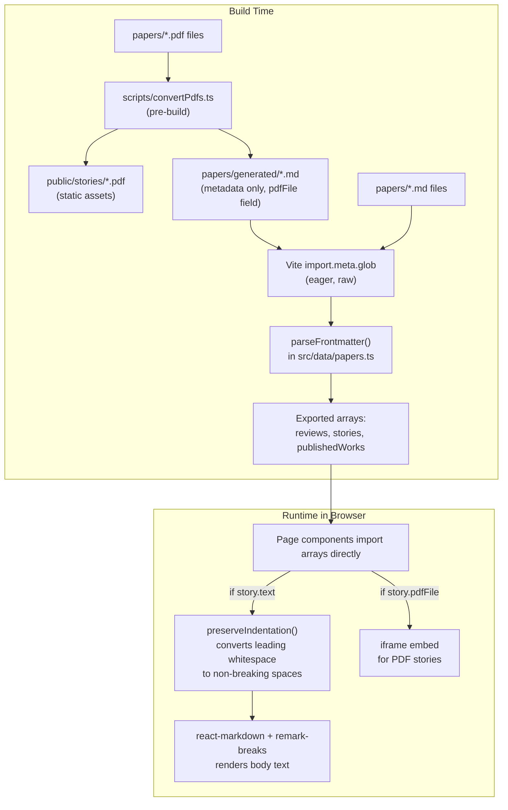

# AGENTS.md

Documentation for AI agents working in this codebase.

## Project Overview

This is a static personal writing portfolio for Hayden Henderson. It displays book reviews, short stories, and published works. All content is authored as markdown files and baked into the JavaScript bundle at build time — there is no backend, no database, no API, and no local storage.

**Tech stack:**

- React 18 with TypeScript
- Vite (build tooling and dev server)
- React Router (client-side routing)
- TailwindCSS (utility-first styling)
- react-markdown + remark-breaks (markdown rendering)
- Vercel (hosting and deployment)
- @vercel/analytics (page-view tracking)

## Architecture



Content flows in one direction: markdown files are read at build time by `src/data/papers.ts`, parsed into typed arrays, and imported directly by page components. PDF stories are served as static assets and displayed via the browser's built-in PDF viewer (iframe). There are no API calls, no runtime fetching, and no client-side state management for content.

## File Structure

```
├── papers/                      # Markdown and PDF content (read at build time)
│   ├── generated/               # Auto-generated .md files from PDFs (gitignored)
│   ├── README.md                # Instructions for adding content
│   ├── example-review.md        # Example book review
│   ├── example-story.md         # Example short story
│   └── example-published.md     # Example published work
├── scripts/
│   └── convertPdfs.ts           # Pre-build script: copies PDFs to public/stories/ and generates metadata-only .md files
├── public/                      # Static assets served as-is
│   ├── backg.jpg                # Background image
│   ├── pp.jpg                   # Profile picture
│   └── stories/                 # PDF files copied here by pre-build script (gitignored)
├── src/
│   ├── App.tsx                  # Router setup, Analytics component
│   ├── main.tsx                 # React DOM entry point
│   ├── index.css                # Global styles, background, fonts
│   ├── vite-env.d.ts            # Vite type declarations (import.meta.glob)
│   ├── data/
│   │   └── papers.ts            # Content ingestion engine (frontmatter parser, glob loader, sorting)
│   ├── types/
│   │   └── index.ts             # TypeScript interfaces: Review, Story, PublishedWork
│   ├── utils/
│   │   └── markdown.ts          # preserveIndentation() helper
│   ├── components/
│   │   ├── Layout.tsx           # Shell: Header + main + Footer
│   │   ├── Header.tsx           # Sticky nav bar with route links
│   │   ├── Footer.tsx           # Copyright footer
│   │   ├── HomeHero.tsx         # Landing page hero section
│   │   ├── ReviewCard.tsx       # Renders a single book review (uses react-markdown)
│   │   └── PublishedWorkCard.tsx # Renders a single published work (uses react-markdown)
│   └── pages/
│       ├── Home.tsx             # Landing page with nav buttons
│       ├── Reviews.tsx          # Lists all reviews using ReviewCard
│       ├── Stories.tsx          # Lists all stories with plaintext excerpts
│       ├── StoryDetail.tsx      # Full story view (react-markdown for text, iframe for PDFs)
│       └── PublishedWorks.tsx   # Lists all published works using PublishedWorkCard
├── vercel.json                  # SPA rewrite rule for Vercel deployment
├── vite.config.ts               # Vite config (React plugin)
├── tailwind.config.js           # Tailwind content paths
├── tsconfig.json                # TypeScript config (strict mode)
└── package.json                 # Dependencies and scripts
```

## Content Pipeline

All content lives in the `papers/` directory as markdown files with YAML frontmatter.

### How it works

1. `src/data/papers.ts` uses `import.meta.glob('/papers/**/*.md', { query: '?raw', import: 'default', eager: true })` to read every `.md` file in `papers/` as a raw string at build time.
2. Each file is parsed by `parseFrontmatter()` which splits the `---` delimited YAML header from the body text.
3. The `type` field in the frontmatter determines which array the content is pushed into: `reviews`, `stories`, or `publishedWorks`.
4. IDs are generated deterministically from the title via `generateId()` (lowercase, alphanumeric, hyphen-separated, max 50 chars).
5. Arrays are sorted newest-first by `createdAt` date.

### Adding content (markdown)

1. Create a `.md` file in `papers/` (any name, nested subdirectories are supported).
2. Add frontmatter at the top between `---` delimiters.
3. Write body content below the frontmatter.
4. Commit and deploy — Vite picks up the new file automatically at build time.

### Adding content (PDF)

PDF files are supported as a content source for **short stories** and are displayed exactly as-is via the browser's built-in PDF viewer:

1. Drop a `.pdf` file into `papers/` (e.g., `papers/My New Story.pdf`).
2. The pre-build script (`scripts/convertPdfs.ts`) automatically runs before `dev` and `build`.
3. It copies the PDF to `public/stories/{slug}.pdf` for static serving.
4. It generates a metadata-only `.md` file in `papers/generated/` with a `pdfFile` frontmatter field pointing to the PDF URL.
5. The title is derived from the filename (e.g., `My New Story.pdf` becomes `My New Story`).
6. The `createdAt` date is taken from the PDF file's last-modified time.
7. Both `papers/generated/` and `public/stories/` are gitignored — they are build artifacts.
8. The existing `import.meta.glob` picks up `papers/generated/*.md` automatically.
9. `StoryDetail.tsx` checks for `story.pdfFile` and renders an `<iframe>` instead of markdown.
10. `Stories.tsx` shows only the title and date for PDF stories (no text excerpt).

PDFs are always ingested as `type: story`. For reviews or published works, use markdown files with the appropriate frontmatter.

### Frontmatter fields

| Field             | Required | Applies to  | Description                                          |
|-------------------|----------|-------------|------------------------------------------------------|
| `type`            | Yes      | all         | `review`, `story`, or `published`                    |
| `title`           | Yes      | all         | Title of the piece                                   |
| `createdAt`       | No       | all         | ISO date string; defaults to build time if omitted   |
| `pdfFile`         | No       | story       | URL path to PDF (e.g., `/stories/my-story.pdf`); auto-generated by pre-build script |
| `description`     | No       | published   | Short description; falls back to first 200 chars of body |
| `publicationDate` | No       | published   | Year or date of publication                          |
| `publisher`       | No       | published   | Publisher name                                       |
| `link`            | No       | published   | URL to the publication                               |

### Example frontmatter

**Review:**
```yaml
---
type: review
title: The Sun Also Rises
createdAt: 2024-01-15T00:00:00.000Z
---
```

**Story:**
```yaml
---
type: story
title: Sardines or Silver Trout?
createdAt: 2026-02-06T00:00:00.000Z
---
```

**Published work:**
```yaml
---
type: published
title: Example Published Work
description: A brief description of the work
publicationDate: 2024
publisher: Publisher Name
link: https://example.com
createdAt: 2024-01-15T00:00:00.000Z
---
```

## Markdown Rendering

Body text is rendered using `react-markdown` with the `remark-breaks` plugin (so single newlines produce `<br>` tags instead of being collapsed).

**Critical:** Before passing text to the `<Markdown>` component, it must be run through `preserveIndentation()` from `src/utils/markdown.ts`. This function converts leading tabs and spaces to non-breaking space characters (`\u00A0`). Without this step, markdown interprets lines with 4+ leading spaces or a leading tab as code blocks, which breaks the formatting of indented dialogue in stories.

Components that render markdown:
- `src/components/ReviewCard.tsx` — renders `review.text`
- `src/components/PublishedWorkCard.tsx` — renders `work.description`
- `src/pages/StoryDetail.tsx` — renders `story.text` for markdown stories, or an `<iframe>` for PDF stories (when `story.pdfFile` is set)

The `Stories.tsx` listing page does NOT use react-markdown; it strips markdown syntax with regex to produce a plaintext excerpt. PDF stories show only title and date (no excerpt).

## Routing and Deployment

### Routes

| Path                | Component        | Description              |
|---------------------|------------------|--------------------------|
| `/`                 | `Home`           | Landing page             |
| `/reviews`          | `Reviews`        | Book reviews listing     |
| `/stories`          | `Stories`        | Short stories listing    |
| `/stories/:id`      | `StoryDetail`    | Individual story view    |
| `/published-works`  | `PublishedWorks`  | Published works listing  |

### Vercel SPA routing

`vercel.json` contains a catch-all rewrite rule that sends all requests to `index.html`, allowing React Router to handle client-side routing. Without this, direct navigation or page refresh on any route other than `/` would return a 404.

### Analytics

`<Analytics />` from `@vercel/analytics/react` is rendered in `App.tsx` alongside the router. It only activates in production on Vercel.

## Styling

### Background image

The background uses a GPU-composited pseudo-element approach for smooth performance across platforms:

- `body::before` — fixed-position layer with the background image (`/backg.jpg`), promoted to its own GPU layer with `will-change: transform`, at `z-index: -2`.
- `body::after` — fixed-position semi-transparent white overlay (`rgba(255,255,255,0.7)`) at `z-index: -1`.

This approach replaced an earlier `background-attachment: fixed` implementation that caused slow rendering on macOS.

### Fonts

The site uses a serif font stack loaded from Google Fonts: `Crimson Text` (body) and `Playfair Display` (headings), with fallbacks to Georgia and Times New Roman.

### Tailwind

Tailwind is configured with default settings. The `prose` utility class (from Tailwind Typography defaults) is used on markdown output containers to style rendered HTML.

## Build and Dev Commands

| Command            | Description                                    |
|--------------------|------------------------------------------------|
| `npm run dev`      | Convert PDFs, then start Vite dev server with hot reload |
| `npm run build`    | Convert PDFs, TypeScript check (`tsc`), then Vite production build |
| `npm run preview`  | Preview the production build locally           |

The `predev` and `prebuild` scripts automatically run `scripts/convertPdfs.ts` via `tsx` before the main command.

## Known Constraints and Gotchas

1. **No dynamic content.** Every content change requires a rebuild and deploy. There is no CMS, no API, and no runtime content loading.

2. **Strict TypeScript.** `tsconfig.json` enables `noUnusedLocals` and `noUnusedParameters`. Unused imports or variables will fail the build. Always clean up imports after refactoring.

3. **Deterministic IDs.** `generateId()` in `src/data/papers.ts` derives IDs solely from the title (lowercased, hyphenated). Two files with the same title will produce the same ID, causing routing collisions. Ensure every paper has a unique title.

4. **Indentation in markdown.** Lines with leading tabs or 4+ spaces are interpreted as code blocks by standard markdown. The `preserveIndentation()` utility must be applied before rendering. If you add a new component that renders markdown body text, remember to use this utility.

5. **Google Fonts import order.** The `@import url(...)` for Google Fonts appears after `@tailwind` directives in `src/index.css`. This produces a non-blocking Vite build warning (`@import must precede all other statements`). It does not break the build or the fonts.

6. **Story excerpts are plaintext.** The `Stories.tsx` listing page strips markdown via regex for excerpts. If new markdown syntax is used in stories (e.g., tables, footnotes), the regex in `getExcerpt()` may need updating.

7. **No test suite.** There are currently no unit or integration tests.

